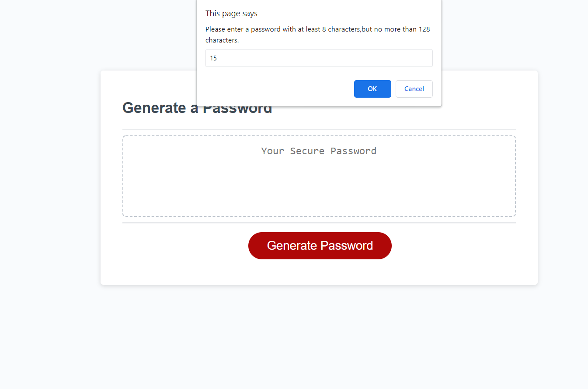
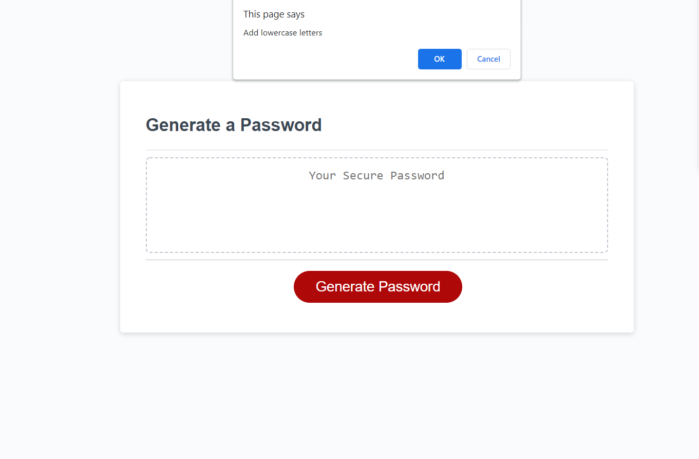
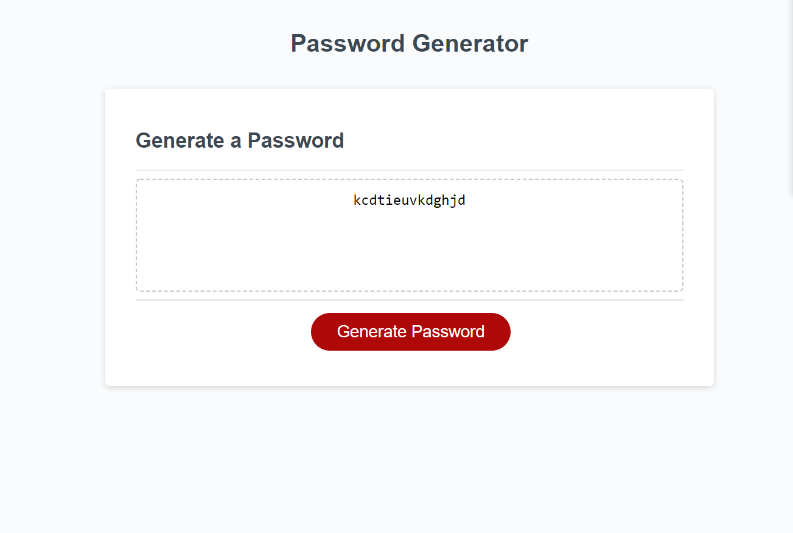

Password-Generator
## The Contents
- [Description](#description)
- [Visuals](#visuals)
- [Usage](#usage)
- [Finished product](#finished-product)

## Description
The added elements include:   

## Usage 
 The site has Javascript that will create a password that is specific  
 standards that are set by the user.

## Visuals

## FInished Product
[Finished product](https://mchapm17.github.io/password-generator/)